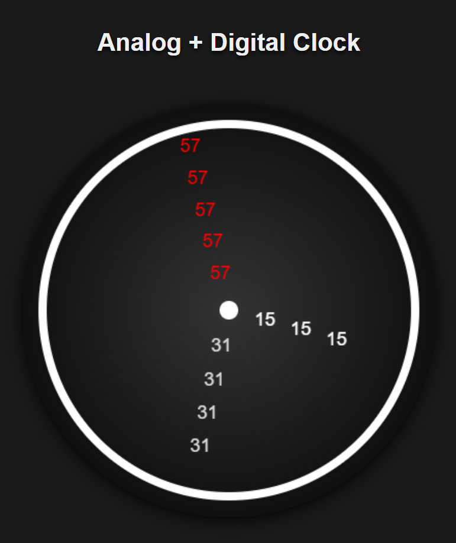

# Analog + Digital Clock

A simple and elegant clock built with HTML5 Canvas and JavaScript. This project combines an analog clock with a digital overlay, featuring real-time updates and a modern design.

## Live Demo

[](https://dilshaprathibha.github.io/Analog-Digital-Clock/)

## Screenshots

<div align="center">

</div>

## Installation

1. Clone the repository:

   ```bash
   git clone https://github.com/DilshaPrathibha/Analog-Digital-Clock.git
